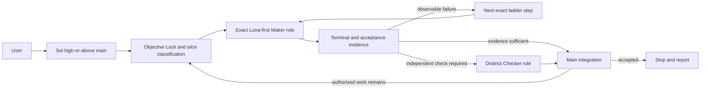

# Adaptive Delegation

**Codex-only skill:** this repository packages a skill for Codex native subagents.
Claude Code and other agent runtimes are not supported execution targets.

`adaptive-delegation` routes bounded Codex work through a Luna-first policy,
raises Luna effort before model tier, then uses evidence-classified Terra
routes after observable Luna acceptance or quality failure, and fixed Sol leaf
roles only when more capability is required. It records observable
outcomes, permits only declared role/model/effort transitions, and returns
unresolved work to the main Codex session when the leaf ladder is exhausted or
the acceptance oracle is weak.

Route choice belongs exclusively to the main Codex session. This is why the
skill requires the main to be `gpt-5.6-sol` at `high` or above: before launching
each child, the main classifies that bounded slice by task shape, oracle
strength, risk and ambiguity, latency sensitivity, execution horizon, and
recoverability. It then selects the matching fixed path. A workflow name never
selects a path by itself, and children cannot reroute themselves.

Explicit `$adaptive-delegation` sessions are controller-only. The main owns
intent, routing, orchestration, evidence integration, and final claims, while
delegable task work runs in package-fixed leaves. The installed hooks deny main
task tools until an exact leaf launch is Objective-Locked or a bounded
evidence-backed main-only exception/takeover is recorded. Cost, task size,
existing context, convenience, and latency never justify direct main work.
The hook accepts only the fixed control-plane and spawn allowlists while
matching both separator-preserving tool names and Codex's sanitized hook names.
Each leaf decision returns a one-time `launch_task_name`; the next native spawn
must use it exactly. This binds the opaque native child message to the recorded
Objective Lock decision without claiming that the hook can decrypt or inspect
the message body. Spawn authorization takes precedence over adaptive-child
metadata carried on the main request, so that metadata cannot bypass the
pending locked launch. Because Codex subagent tool hooks share the parent
`session_id`, the controller records the main `turn_id` and, after an exact
launch, binds the one child turn whose owner-only rollout metadata matches the
issued task name, role, parent, and start turn. Later user prompts refresh the
main turn binding before any task tool can run; other turns remain denied.
Repeating an explicit invocation preserves the existing open controller rather
than replacing its Objective Lock or pending launch.
Each authorized Native launch must be closed with a structured controller
result before another route decision; that result creates a cumulative local
controller review. The main closes the controller as `complete` or `blocked`
before its terminal answer, preventing stale state from restricting a later
non-adaptive request in the same conversation.

Codex prompt-hook input identifies the current model but may omit reasoning
effort. In that case the controller validates the Sol model, creates an
owner-only pending declaration state, and injects the exact bounded
declaration command as model-visible context. Task tools remain denied until
the main declares the current session at `high` or above.

Its primary invariant is: delegate bounded independent work aggressively, but
only inside one portable Objective Lock. No valid lock means no child launch;
no external `AGENTS.md` is required to construct or enforce the packaged lock.

The repository and its packaged policy are canonical. Installed copies are
deployment targets, not additional policy sources.

Current installable package version: `0.7.5`.

### Read-only evidence health

Run `python3 adaptive-delegation/scripts/model_routing_audit.py health` to
inspect sanitized attempt, cumulative-review, continuity-shape, dispatch,
controller-enforcement, and current-policy evidence. The command accepts
`--ledger`, `--review-dir`, `--continuity-ledger`, `--dispatch-ledger`,
`--controller-ledger`, and `--format {json,text}`. It
returns schema `0.1.0`, exits `0` for `healthy` or `partial`, and exits `2`
for `degraded` while still emitting the report. Required policy and attempt
sources are fail-closed; review, continuity, dispatch, and controller sources
are optional.
Rows that fail validation are excluded from aggregates and represented only by
fixed diagnostic counts. Continuity scanning is aggregate-only and the command
does not append, rewrite, backfill, finalize, or create any runtime state.
The independent `evidence_sufficiency.status` field uses only current-policy
paired acceptance and integration facts and remains insufficient until at
least 25 accepted and integrated tasks exist. Historical success cannot make
current evidence sufficient. Each cumulative review names its trigger and
covered pair count, distinguishes missing cost observations from observed zero,
and reports model selection as appropriate, underpowered, overpowered, or
inconclusive alongside quality outcomes. The command never recommends a routing
change by itself.

External research, benchmark snapshots, practitioner reports, confidence
limits, and the current routing decision are preserved in
[`docs/research/MODEL_ROUTING_EVIDENCE.md`](docs/research/MODEL_ROUTING_EVIDENCE.md).
Its cost-latency-capability matrix distinguishes Terra `medium/high` latency
use from the slower quota-first `xhigh/max` hypothesis. Maintainers must read
that matrix together with the latest local accepted-task review before
evaluating or changing model routing; local outcomes remain the primary
evidence. Runtime invocations do not load this non-deployed dossier
automatically, which preserves the skill's token-efficient runtime context.

For prompt-driven installation or updates on another developer's computer,
send Codex the copy-paste workflow in
[`CODEX-INSTALL-PROMPT.md`](CODEX-INSTALL-PROMPT.md). It authorizes the final
user-level install only after validation and isolated promotion pass.

## What the skill validates and requires

The dispatcher fails closed on the typed/direct paths it owns. For an explicit
invocation, installed `UserPromptSubmit` and `PreToolUse` hooks additionally
enforce the controller boundary before main task tools run. This is a same-user
policy boundary, not an operating-system security boundary.

- The declared main session must be `gpt-5.6-sol` at `high`, `xhigh`, `max`, or
  `ultra` before a package-owned child can launch.
- The main must record the Objective Lock digest and exact fixed
  role/model/effort before a native leaf launch, then use the returned
  `launch_task_name` exactly. A task/role/model/effort mismatch is denied.
- The main must record the leaf outcome, route fitness, quality/integration
  verdict, measurement coverage, and bounded evidence before another decision.
  Missing token usage is unavailable, never observed zero.
- Direct main execution requires a structured `non_delegable_authority`,
  `weak_oracle`, `high_risk_or_ambiguous`, or exhausted-ladder record with
  bounded evidence. Weak/high-risk work and takeover additionally require the
  declared main to be `ultra`; economic discretion is not an exception.
- Every default and escalation step resolves to an installed, package-declared
  Codex role with an exact model and reasoning effort.
- Leaf `ultra` and silent model substitution are forbidden.
- Model or reasoning escalation changes capability, not authority or scope.
  The policy requires every child and main-authority takeover to stay inside
  the canonical Objective Lock: terminal outcome, non-goals, read/write/network
  authority, authorized lanes, progression policy, and global terminal
  conditions. The terminal outcome is stable while
  the current path/iteration envelope (method, data source, stage, test plan,
  and path-local verification) can be replaced. A blocked path returns to main
  for an in-scope alternative; final BLOCKED requires evidence that no
  meaningful in-scope path remains. Never fabricate evidence or substitute an
  unauthorized method. A truthful blocked-lane report is a successful child
  process result but not an accepted terminal outcome: its receipt records
  `path_blocked`, and main continues with another authorized lane.
- The same lock binds main-side planning, repository inspection, routing
  preflight, verification, retry decisions, and integration. A fresh one-shot
  task with complete acceptance evidence skips continuity and does not reopen
  optional package internals.
- Retry and escalation decisions must follow observable failure evidence and a
  contiguous route history. Arbitrary jumps and exhausted same-route retries
  fail closed.
- A successful child process is not local integration finalization. Optional
  local integration receipts are evaluated only after execution and must
  match the exact packet, Objective Lock digest, child terminal result,
  output/worktree digests, route, and a distinct-session Checker.
- Successful execution remains pending in the append-only routing ledger until
  integration finalization succeeds. Receipt or pre-gate failures can be
  corrected only with the same installed terminal/receipt/audit schema.
- Before updating from terminal/receipt v1 and audit `0.2.0`, finalize every
  pending attempt. After the update, an old pending chain remains readable
  evidence but deliberately cannot be finalized or backfilled. Re-execute it
  as a fresh chain with a new task ID, attempt index 1, dispatch ID, packet, and
  v3 terminal/receipt plus `0.3.0` audit records.
- The package remains pre-1.0. It keeps Objective Lock v1/v2 audit evidence
  readable but starts new work with Objective Lock v3 and never continues a
  task across lock or routing-policy versions. Preserve an older pending chain
  as historical evidence and re-execute the bounded task with a new task ID,
  dispatch ID, and packet.

The main-profile eligibility gate uses declared current-session context; main
authority comes from the user/control topology, not from model capability.
Local receipts provide same-user integrity and consistency checks; they are
not signatures, remote attestation, proof of semantic correctness, or a
security boundary against a malicious process running as the same
operating-system user.

The dispatcher renders one route-independent canonical Objective Lock v3 JSON
for both Native and typed execution. Its version and SHA-256 consistency digest
remain identical across retries, effort/model escalation, and main takeover;
linked audit schema `0.3.0` rejects a changed digest or mixed `0.2.0`/`0.3.0`
task history. This detects local contract drift on dispatcher-owned paths; it
does not prove semantic correctness or create a security principal.

The current package requires an explicit `terminal_outcome` and `lane_id` in
every packet and separates the stable terminal-outcome lock from the
replaceable path/iteration envelope. Re-execute unfinished packets from an
older incompatible wire contract as fresh tasks.

## Maker, Checker, and final acceptance

Maker roles perform one main-selected bounded change. Checker roles inspect
declared acceptance evidence from a distinct session when risk or the
integration contract requires independence; they do not join the Maker
escalation ladder or add an automatic extra review. The package has no separate
adaptive Verifier role. Main owns route selection, evidence integration, the
final acceptance claim, and the stop decision without redoing every leaf
check. The dispatcher's integration-receipt wire contract specifically
requires `adaptive-sol-checker-medium` as its independent issuer.
Checker capability follows oracle shape and risk; it is not required to exceed
the Maker model. A real artifact rejection advances the exact Maker ladder, a
Checker tool failure retries the Checker environment without upgrading Maker,
and a weak oracle returns directly to main Sol/ultra authority.



See [`docs/DELEGATION-FLOW.md`](docs/DELEGATION-FLOW.md) for the full role
matrix, end-to-end flow, Checker receipt rule, escalation paths, and the reason
final verification remains main-authoritative.

## Activate the skill

Use `$adaptive-delegation` explicitly. This skill is explicit and opt-in:
matching prose,
bare workflow names, localized trigger literals, and old session artifacts do
not activate it. The skill frontmatter retains search vocabulary for discovery,
but discovery is not activation. See
[`adaptive-delegation/references/TRIGGERS.md`](adaptive-delegation/references/TRIGGERS.md).
No additional Luna-first, stop-on-acceptance, or no-extra-review prompt is
required; those constraints are part of the installed skill contract.

## Invocation and `ultra` reasoning behavior

Skill activation and reasoning effort are separate decisions. Invoking the
skill does not change the running main model or its effort, and requesting
`ultra` does not grant `ultra` to a child.

| Request form | Activation behavior | Model and effort behavior |
| --- | --- | --- |
| `$adaptive-delegation ...` | Deterministic explicit activation. | The main-authority gate runs, an Objective Lock is created, and bounded work follows the Luna-first route. |
| `$adaptive-delegation ... Use ultra reasoning.` | Deterministic explicit activation. | `ultra` applies to the main only if the current runtime is already configured as `gpt-5.6-sol/ultra`. Prompt text cannot upgrade the session. Leaf `ultra` remains forbidden. |
| A matching bounded task without `$adaptive-delegation` | Does not activate this skill. | Scoped main-direct behavior and any separately invoked workflow remain unchanged. |
| A localized token-efficiency request, with or without `Use ultra reasoning.` | Does not activate this skill. | Search vocabulary cannot activate routing or upgrade the session. |
| `Use ultra reasoning.` | Does not activate this skill by itself. | Normal session-level model and effort rules apply. |

A localized trigger must occur in an actionable delegation, implementation, or
verification request. Quoting the word, translating it, or asking only for its
definition does not request adaptive routing.

After explicit activation:

1. Validate that the current main is `gpt-5.6-sol` at `high` or above. When the
   prompt hook omits reasoning effort, the main completes the bounded
   controller declaration from the injected model-visible context before any
   task tool. The skill cannot mutate a failing parent configuration.
2. Construct one portable Objective Lock before any child launch.
3. The main classifies every bounded slice before launch. It records task
   shape, oracle strength, risk and ambiguity, latency sensitivity, execution
   horizon, and recoverability, then selects the matching fixed path. Workflow
   labels such as `Goal` or `Ultragoal` are not route inputs.
4. Route simple work to Luna `medium`, clear implementation to Luna `high`, and
   bounded complex work to Luna `xhigh`. The quota-first long-horizon path
   starts at Luna `max` whenever long-horizon execution, latency insensitivity,
   a strong oracle, and `low`/`medium` risk are all established for that slice,
   regardless of whether Goal or Ultragoal is active.
5. Escalate only from observable failure evidence, preserving the exact lock.
   Luna effort may rise through `max`; ordinary work may use Terra
   `medium/high`, while latency-insensitive long-horizon work may use Terra
   `xhigh/max` before Sol. Leaf `ultra` is never allowed.
6. Keep weak-oracle, ambiguous, high-risk, or long-contract work with the main
   at `gpt-5.6-sol/ultra`, or return exhausted leaf work to that main takeover.
7. Keep the main on control-plane operations throughout delegated work. It may
   execute directly only through an evidence-backed main-only exception or an
   exhausted-ladder takeover; cost and convenience cannot open that lane.
8. Stop as soon as the locked acceptance evidence passes. Do not add another
   review or broader verification merely because the main has `ultra` effort.

The fixed automatic paths are:

The table is a main-selected classification map, not a global preference
order. Different bounded slices in the same goal may use different rows.

| Work shape | Fixed path |
| --- | --- |
| Simple lookup or extraction | `Luna medium -> Luna high -> Luna xhigh -> Luna max -> Terra medium -> Sol medium -> main Sol ultra` |
| Clear implementation or transformation | `Luna high -> Luna xhigh -> Luna max -> Terra medium -> Sol medium -> Sol high -> main Sol ultra` |
| Bounded complex implementation, debugging, or review | `Luna xhigh -> Luna max -> Terra high -> Sol medium -> Sol high -> main Sol ultra` |
| Any bounded slice where long-horizon, latency-insensitive, strong-oracle, and low/medium-risk predicates all pass | `Luna max -> Terra xhigh -> Terra max -> Sol high -> main Sol ultra` |
| Weak oracle, ambiguous/high-risk, or long contract | `main Sol ultra` |

Terra `xhigh` and `max` are restricted to the quota-first long-horizon path and
require preceding Luna failure. Ordinary runs passively log
`use_mode=post_luna_failure` or `use_mode=direct_latency`; later audits compare
accepted-task outcomes rather than running perpetual, random, or duplicate
paired experiments. The main may directly select Terra only with a
pre-observable latency-sensitive, scoped, strong-oracle, recoverable,
non-ambiguous predicate. Terra has no `ultra` route.

## Maintainer promotion and local deployment order

`main` is the only deployable branch. Never install a feature branch,
uncommitted worktree, or unpublished commit into a user Codex home.

For every installable change:

1. Complete the change on a feature branch and update the relevant README or
   installation documentation, `CHANGELOG.md`, and
   `adaptive-delegation/VERSION` when package contents change.
2. Run the targeted and package validation required by this repository.
3. Review the entire README against the active `SKILL.md`, package policy,
   version, installation flow, and reporting flow. Commit every required
   correction; a partial section-only review is not sufficient.
4. Commit and push the feature branch, then require this fail-closed gate:
   `python3 scripts/release_preflight.py --mode pre-merge`. It verifies the
   README version, invocation invariants, every configured route ladder, the
   changelog, clean feature branch, and pushed upstream commit.
5. Merge the verified feature branch into `main`, then push `main`.
6. Fetch the remote and run
   `python3 scripts/release_preflight.py --mode deploy`. It requires a clean
   `main` or detached checkout whose commit exactly matches `origin/main`, and
   repeats the full README-to-package contract check.
7. Verify that the deployment checkout is clean and its
   commit exactly matches `origin/main`.
8. Only then run the isolated promotion gate and user-level installer from
   that published `main` commit.
9. Finish by requiring `version_status.py` to report `status=current` with
   matching source and installed digests.

This order applies to the maintainer's own computer and to prompt-driven
installation on other computers. Release history belongs in `CHANGELOG.md`;
README and installation documents describe the active behavior and procedure.

## Install from GitHub

Python 3.11 or newer is required.

```sh
git clone https://github.com/ai-dev-methodologies/adaptive-delegation.git
cd adaptive-delegation
python3 scripts/release_preflight.py --mode deploy
python3 scripts/install.py --dry-run
python3 -m unittest -v tests.test_install tests.test_dispatcher_gate tests.test_isolated_dogfood tests.test_version_status tests.test_release_preflight
python3 -m unittest discover -v -s adaptive-delegation/tests -p 'test_*.py'
python3 scripts/verify_isolated_dogfood.py --auth-source /path/to/read-only-auth.json
# With explicit user approval only:
python3 scripts/install.py
```

The default target is `$CODEX_HOME`, or `~/.codex` when `CODEX_HOME` is unset.
Use `--codex-home /path/to/.codex` for another target. The installer replaces
each managed target safely, preserves unrelated roles and existing directory
permissions, and removes only stale adaptive roles declared by the previously
installed package. It also adds one `adaptive-delegation` command handler to
`UserPromptSubmit` and `PreToolUse`, writes matching Codex trust entries,
preserves foreign handlers, and never adds or replaces a Stop handler.

The installer never copies authentication, audit logs, issue-report state,
continuity records, or rollout/session data. Those remain local to the machine
that created them. It also excludes repository tests, deployment-only
documentation, maintainer references, bytecode, and caches from the installed
skill; `scripts/package_manifest.py` defines the exact runtime allowlist.
The isolated promotion gate is mandatory before user-level installation; it is
a same-user quality guard, not a security boundary. Its routing preflight
allows bounded policy and exact role lookups while rejecting broad package
enumeration. It fingerprints the installed skill, dispatcher, roles, hooks,
and Codex config; normal owner-only runtime audit appends are evidence, not an
installation mutation. See [`INSTALL.md`](INSTALL.md) for its
temporary-auth-symlink workflow and the explicit later approval step.
For the complete install, update, rollback, and second-PC workflow, see
[`INSTALL.md`](INSTALL.md).

## Validate the package

```sh
python3 scripts/install.py --dry-run
python3 -m unittest -v tests.test_install tests.test_dispatcher_gate tests.test_isolated_dogfood tests.test_version_status tests.test_release_preflight
python3 -m unittest discover -v -s adaptive-delegation/tests -p 'test_*.py'
```

Skill files may be detected automatically, but hook topology is cached by the
running process. Start a fresh Codex process after installing this release,
then invoke `$adaptive-delegation` to verify controller events and routing data
from the new deployment baseline.

## Version and update comparison

[`adaptive-delegation/VERSION`](adaptive-delegation/VERSION) is the canonical
Semantic Version and is copied into every installed package. Human-readable
release changes are recorded in [`CHANGELOG.md`](CHANGELOG.md). Installable
package changes must update both files.

Compare a checkout with the installed package without changing either:

```sh
python3 scripts/version_status.py
```

Use `--codex-home /path/to/.codex` for another target or `--json` for stable
machine-readable output. The command reports versions, package digests, and
relative `source_only`, `installed_only`, and `modified` paths. A matching
version with a different digest is `same_version_drift`; an older unversioned
installation is `installed_unversioned`.

## Local experience and GitHub issues

Routing attempts are stored locally in
`$CODEX_HOME/state/model-routing/attempts.jsonl` (default
`~/.codex/state/model-routing/attempts.jsonl`). Raw ledgers contain local
identifiers and must never be uploaded.

For the complete distinction between project files, routing attempts, reviews,
dispatcher evidence, optional continuity, Codex rollout history, and ephemeral
polling monitors, see
[`docs/LOCAL-LOGGING-AND-MONITORING.md`](docs/LOCAL-LOGGING-AND-MONITORING.md).
It includes the record lifecycle diagram, pending/failed/accepted meanings,
the inspection order, and exactly what remains after monitoring stops.

Generate an allowlisted Markdown summary instead:

```sh
python3 adaptive-delegation/scripts/model_routing_audit.py issue-report
```

The formatter never modifies the attempts ledger. It creates or reuses a
random Report ID in the separate owner-only
`$CODEX_HOME/state/model-routing/issue-report-state.jsonl` management ledger.
After an issue is published, `record-submission` binds the Report ID to its
canonical issue URL. Later reports automatically exclude the attempt
fingerprints covered by submitted receipts; a pending report reuses the same
ID so a publication retry can find the existing issue instead of duplicating
it.

Its Markdown prints no task/session identifiers, paths, prompts, evidence
text, commands, credentials, or private URLs. Neither the raw attempts ledger
nor the issue-state ledger may be uploaded. To have Codex perform the complete
duplicate-aware issue workflow, send it the packaged
[`CODEX-ISSUE-REPORT-PROMPT.md`](adaptive-delegation/references/CODEX-ISSUE-REPORT-PROMPT.md).
See [`REPORTING.md`](REPORTING.md) for the state contract and manual commands.

## Repository map

- [`adaptive-delegation/SKILL.md`](adaptive-delegation/SKILL.md) — Codex skill
  workflow and operational contract.
- [`adaptive-delegation/config/model-routing.defaults.json`](adaptive-delegation/config/model-routing.defaults.json)
  — package policy source of truth.
- [`adaptive-delegation/references/MODEL_ROUTING_POLICY.md`](adaptive-delegation/references/MODEL_ROUTING_POLICY.md)
  — rationale, ladders, failure actions, and metrics.
- [`adaptive-delegation/references/CODEX-ISSUE-REPORT-PROMPT.md`](adaptive-delegation/references/CODEX-ISSUE-REPORT-PROMPT.md)
  — copy-paste Codex prompt for one privacy-safe, deduplicated feedback issue.
- [`docs/DELEGATION-FLOW.md`](docs/DELEGATION-FLOW.md) — maintained Maker,
  Checker, main-authority, escalation, integration, and issue-feedback diagram.
- [`docs/LOCAL-LOGGING-AND-MONITORING.md`](docs/LOCAL-LOGGING-AND-MONITORING.md)
  — local artifact ownership, audit-event lifecycle, privacy boundaries, and
  ephemeral monitoring diagram and procedure.
- [`docs/research/MODEL_ROUTING_EVIDENCE.md`](docs/research/MODEL_ROUTING_EVIDENCE.md)
  — non-deployed cost, latency, benchmark, community, and local-review evidence
  used before model-routing policy changes.
- [`INSTALL.md`](INSTALL.md) — installation and cross-PC operations.
- [`CODEX-INSTALL-PROMPT.md`](CODEX-INSTALL-PROMPT.md) — copy-paste Codex CLI
  installation and update prompts.
- [`scripts/release_preflight.py`](scripts/release_preflight.py) — mandatory
  README/config/Git gate before feature merge and published-main deployment.
- [`scripts/package_manifest.py`](scripts/package_manifest.py) — exact
  allowlist for files installed into the runtime skill package.
- [`CHANGELOG.md`](CHANGELOG.md) and
  [`adaptive-delegation/VERSION`](adaptive-delegation/VERSION) — release
  history and installed package version.
- [`REPORTING.md`](REPORTING.md) — privacy-safe issue workflow.
- [`AGENTS.md`](AGENTS.md) — repository maintenance rules.

Canonical repository:
<https://github.com/ai-dev-methodologies/adaptive-delegation.git>
