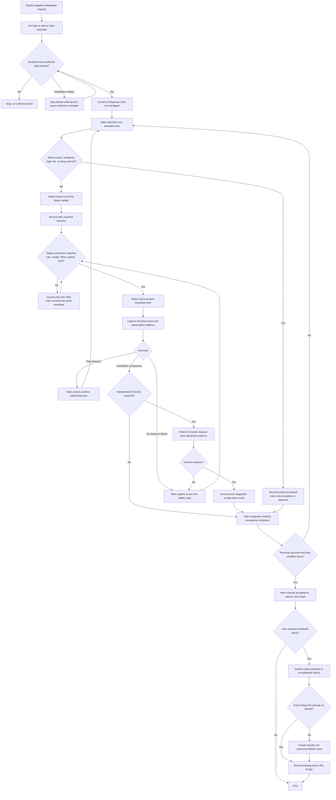

# Adaptive Delegation execution flow

This document is the maintained architecture view for the Codex-only
`adaptive-delegation` skill. The package policy and dispatcher remain the
executable sources of truth when this explanation differs from runtime code.

## Role ownership

| Role | Responsibility | Invocation point | May change scope or route? |
| --- | --- | --- | --- |
| Main authority | Build the Objective Lock, classify each bounded slice, select routes, orchestrate leaves, integrate returned evidence, decide retry/escalation/takeover, and make the final claim. | Normal skill loading for a `$adaptive-delegation`-prefixed prompt with declared `gpt-5.6-sol` at `high` or above. The package installs no hook; non-prefix mentions do not activate. | Main direct work requires a bounded authority or context justification, or exhausted-ladder takeover. Generic convenience is insufficient. |
| Maker leaf | Perform one bounded implementation, transformation, lookup, or other owned change. | Main launches the exact package role selected by the task-class ladder. | No. It reports evidence and returns control to main. |
| Checker leaf | Independently test declared acceptance evidence without owning the Maker's change. | Main uses a distinct session when risk warrants independent checking. Package-owned integration finalization specifically requires `adaptive-sol-checker-medium` as the receipt issuer. | No. Checker routes do not join or alter the Maker escalation ladder. |
| Final verifier | No separate package role exists. | Not invoked as an additional mandatory stage. | Not applicable. Checker supplies independent leaf evidence; main owns final integration acceptance and stopping. |

A general Codex `verifier` role may exist in a user's wider Codex installation,
but it is not part of this package's fixed adaptive role contract. Adding it as
an automatic third review stage would duplicate Checker work, consume extra
quota, and violate stop-at-acceptance unless a future policy change gives it a
distinct, observable responsibility.

## End-to-end flow

## When Maker is invoked

Main invokes a Maker only after it has:

1. passed the main-authority activation gate;
2. constructed a complete Objective Lock;
3. reduced work to one bounded, owned slice with an observable oracle;
4. classified the slice independently of workflow labels; and
5. resolved an exact package role, model, and effort.

Maker routes form the escalation ladders. Observable acceptance or quality
failure may advance to the next configured Maker route. A model or effort
change never gives the Maker authority to reinterpret intent, broaden scope,
or add verification.

Main launches only the verified `agent_type`, model, reasoning effort,
`fork_turns="none"`, and Objective Lock packet selected for the lane. A routing
mismatch cancels only that child launch and returns control to main. No package
hook blocks unrelated main or host-runtime operations.

## When Checker is invoked

Checker is not an unconditional second opinion. Main invokes a Checker when
the declared risk or integration contract requires independent evidence. The
Checker must run in a session distinct from the Maker and main, must not modify
the Maker-owned surface, and must stop after the declared checks pass or fail.

The package has several fixed Checker role bindings so main can choose a
bounded independent-check surface by task risk. These roles do not form an
escalation ladder. For the dispatcher's cryptographically digested local
integration-receipt path, the current wire contract is stricter: the receipt
issuer must be the installed `adaptive-sol-checker-medium` binding. Other
Checker results can inform main, but they cannot impersonate that receipt
issuer.

Checker capability is selected from the oracle shape and risk, not by a rule
that it must always exceed the Maker model. A narrow deterministic test can be
checked reliably by a cheaper model even when the Maker needed a higher model
for implementation. A semantic or weak-oracle judgment stays with main rather
than creating an unbounded sequence of stronger Checkers.

Checker outcomes have distinct recovery paths:

| Observation | Classification | Recovery |
| --- | --- | --- |
| The declared oracle rejects the Maker artifact. | `acceptance_quality_failure` | Return to main and advance the exact Maker ladder under the same Objective Lock. Do not merely upgrade the Checker. |
| The Checker encounters a tool or environment failure. | `tool_or_environment` | Repair or retry the Checker environment on the same route. Do not upgrade the Maker. |
| The Checker demonstrably lacks capability for the bounded check. | `capability_ceiling` | Main may select a stronger package-declared Checker surface without changing the Maker artifact or scope. |
| The oracle cannot establish acceptance. | `weak_oracle` | Stop leaf escalation and return to main Sol/ultra authority. |

This separation is the token-efficiency reason for Checker leaves: when
independence is required, a fresh bounded Checker can consume much less context
than asking the Sol/ultra main to reconstruct and re-review the entire Maker
session. It is still more expensive than stopping on already-sufficient
evidence, so Checker invocation remains conditional.

## Why main owns final verification

The final decision combines user intent, the stable Objective Lock, Maker
terminal evidence, optional Checker evidence, authorized-lane exhaustion, and
the global stop condition. Only main holds all of those inputs and authority.
Therefore main performs integration acceptance and the final user-facing
claim; it does not redo every leaf check. A separate mandatory verifier would
be justified only if it received a non-overlapping acceptance responsibility
that Checker and main do not already own.
