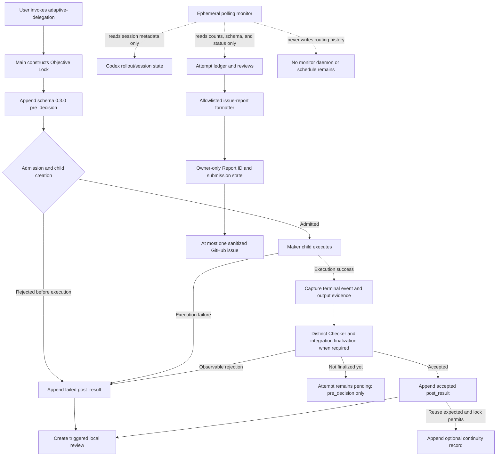

# Local logging and monitoring

This document explains what `adaptive-delegation` records on one Codex
computer, what a temporary monitor observes, what remains after monitoring
stops, and which artifacts a user should inspect. It is an operational guide,
not an additional routing-policy source.

## Mental model

There are three separate layers:

1. **The project workspace** contains the product files changed by the task.
2. **Adaptive-delegation runtime state** records routing, admission, execution,
   checking, integration, review, and optional continuity evidence under the
   local Codex runtime home.
3. **Codex host session state** stores Codex conversation and tool history. It
   is owned by Codex, not by this skill, and can contain raw prompts or other
   private context.

The central runtime log is not written inside each project repository. Resolve
the runtime home from `CODEX_HOME`; when it is unset, the default is
`~/.codex`. In the paths below, `$RUNTIME_HOME` means that resolved directory.

## End-to-end record flow



The important distinction is that child-process success is not integration
acceptance. A successful child remains pending until the required Checker and
integration evidence is finalized. A rejection or execution failure closes the
attempt immediately with a failed `post_result`.

## Durable local artifacts

| Artifact | Owner | Created or updated when | What it means | User handling |
| --- | --- | --- | --- | --- |
| `$RUNTIME_HOME/state/model-routing/attempts.jsonl` | Adaptive-delegation audit layer | `pre_decision` is appended before package-owned execution; `post_result` is appended on immediate failure or successful integration finalization. | Append-only routing history, including model, effort, observable result, escalation counts, oracle verdict, and integration status. | Primary source for automated analysis. Treat as sensitive; do not upload, paste, or casually print raw lines. |
| `$RUNTIME_HOME/state/model-routing/reviews/*.json` | Adaptive-delegation audit layer | Automatically for failures, escalations, direct-Sol use, non-`correct` route assessments, price changes, and periodic accepted-attempt cadence. | A deterministic aggregate review linked to ledger evidence. | Prefer these bounded review artifacts over raw ledger inspection when one exists. Keep local. |
| `$RUNTIME_HOME/state/adaptive-delegation/` | Dispatcher and integration paths | During admission, terminal capture, receipt handling, integration checking, or other package-owned evidence steps. | May contain attestation ledgers, bounded packet files, terminal records, and integration evidence. Exact internal filenames depend on the dispatch path. | Diagnostic evidence, not the normal user dashboard. Keep local and never copy into the repository. |
| `$RUNTIME_HOME/state/adaptive-delegation/continuity.jsonl` | Optional continuity layer | Only after acceptance or handoff when reuse is expected and the Objective Lock permits the state write. | Compact accepted route/evidence reuse hints for the same stable workspace/objective pair. It is not a log of every task. | Read only through the packaged `read_continuity.py` helper with an exact workspace and objective key. Never use `cat`, `tail`, or `grep`. |
| `$RUNTIME_HOME/state/model-routing/issue-report-state.jsonl` | Issue-report workflow | When `issue-report` prepares a Report ID and when `record-submission` binds a published issue URL. | Owner-only duplicate memory: pending/submitted Report IDs and hashed attempt coverage. | Preserve across updates; never upload or copy to another computer. |
| `$RUNTIME_HOME/sessions/**/rollout-*.jsonl` | Codex host | During every Codex root or child session. | Host conversation, tool, and session metadata. This can prove whether a root was new or resumed, but it is not routing acceptance evidence. | Highly private host data. Never use it as a public issue attachment or substitute it for dispatcher evidence. |
| Project working tree | The active task | When an authorized Maker or main changes product files. | The actual implementation result. | Version and review according to the project. Adaptive runtime logs remain outside it. |

The installer deliberately does not copy any of these state files. Skill
updates preserve local state on the machine where it was created, while a new
computer starts with its own independent history.

## Reading attempt state correctly

Interpret one task attempt as a pair of audit events:

| Observed audit state | Meaning |
| --- | --- |
| No `pre_decision` | The package-owned dispatcher record path was not reached. Merely mentioning the skill or directly spawning a child is not sufficient evidence. |
| `pre_decision` only | The attempt is pending. It may still be executing, waiting for corrected integration evidence, or awaiting finalization. |
| `pre_decision` plus failed `post_result` | Admission, execution, oracle, or integration failed and the attempt was closed. Read the bounded failure class, oracle verdict, route assessment, and next action. |
| `pre_decision` plus `post_result` with `accepted=true` and `integration_accepted=true` | The package-owned integration path accepted the attempt. This is the record needed for accepted-task routing analysis. |
| Old-schema `pre_decision` without a matching result after a schema cutover | Historical pending evidence only. It cannot be backfilled or finalized under the new schema; re-execute the bounded task as a fresh chain if it still matters. |

`execution_completed=true` alone does not mean accepted. Likewise, the
existence of a child rollout file proves that a child session existed, not that
its result passed the declared oracle or integration contract.

## What temporary monitoring does

A monitoring pass is a read-only observer created for a bounded time window.
The pass used to verify a newly started workflow should check only:

1. whether Codex session metadata shows a new or resumed root for the expected
   workspace;
2. whether the central attempt ledger gains a schema `0.3.0` `pre_decision`;
3. whether a matching `post_result` appears;
4. whether that result is failed, pending, or integration-accepted; and
5. whether a triggered review is created when policy requires one.

The polling interval and observation window are temporary process settings,
not adaptive-delegation configuration. When the success condition is observed
or the bounded window expires, terminate the monitor. A correct monitoring pass
leaves no cron job, launch agent, daemon, hook, polling configuration, or
repository file. The only durable effects are:

- records independently written by the active adaptive-delegation workflow;
- any automatic review produced by that workflow; and
- the ordinary private Codex transcript of the session that performed the
  monitoring.

The monitor must not create, repair, backfill, or reinterpret routing events.
It reports what the package wrote. Monitoring absence is not execution
failure, while a recorded failed `post_result` is a real closed attempt.

## Practical inspection order

For routine use, follow this order:

1. Run the packaged evidence-health command for sanitized aggregate status:

   ```sh
   python3 adaptive-delegation/scripts/model_routing_audit.py health
   ```

2. Confirm that the attempt ledger modification time changed after the
   invocation.
3. Inspect the latest relevant review when one was triggered.
4. Open dispatcher evidence only to diagnose a concrete admission or
   integration failure.
5. Consult continuity for a repeated stable objective only through the exact
   match helper described below.
6. Use the allowlisted issue-report workflow only when intentionally preparing
   public feedback.

`health` is read-only and emits schema `0.1.0`. Required policy and attempt
sources fail closed. Missing optional review, continuity, or dispatch sources
produce `partial` with exit 0; any required unavailable source or any present
malformed, unreadable, or unsafe source produces `degraded` with exit 2 while
still emitting a sanitized report. `healthy` and `partial` do not mean that
route-tuning evidence is sufficient: read the independent
`evidence_sufficiency.status` field. Review files are cumulative snapshots, so
the command selects the latest unambiguous parsed `generated_at` instead of
summing snapshots.

The command's whole-ledger continuity scan is a narrow operator-health
exception to objective-specific continuity lookup. It performs a bounded,
owner-only, no-symlink read and emits only fixed aggregate categories:
`accepted`, `nonaccepted`, `attestation`, and `unknown`. It never emits
workspace/objective text, evidence paths, prompts, or raw records and never
creates, appends, rewrites, backfills, or finalizes state. For actual continuity
reuse, the normal rule remains unchanged: use `read_continuity.py` with an exact
workspace and objective key, and never use `cat`, `tail`, or `grep`.

A suitable read-only request is:

```text
Analyze the local adaptive-delegation routing history for this workspace.
Do not print raw ledger lines, prompts, task/session identifiers, or paths.
Report only schema versions, pre/post counts, pending attempts, model/effort
counts, observable failure or escalation classes, route assessments, and
integration-accepted counts.
```

For public feedback, do not reuse that general analysis output. Use the
packaged issue-report prompt and sanitizer described in
[`../REPORTING.md`](../REPORTING.md).

## Troubleshooting conclusions

| Observation | Conclusion | Next bounded check |
| --- | --- | --- |
| A new Codex process exists, but the root session metadata is old. | The application restarted and resumed an existing conversation. | Decide whether to start a genuinely new root conversation or explicitly reload the current installed skill contract for a fresh task chain. |
| New adaptive child sessions exist, but no new `pre_decision` exists. | Child creation bypassed or never reached the package dispatcher record path. | Verify the explicit invocation and documented admission sequence before another child launch. |
| A new `pre_decision` and failed `post_result` appear. | Logging works; the attempt itself failed or stopped before acceptance. | Inspect only the bounded failure class, oracle verdict, next action, and linked review/evidence. |
| A `pre_decision` remains without a result. | The attempt is pending, not accepted or rejected. | Check whether execution or integration finalization is still active before retrying. |
| An accepted result exists but continuity does not change. | This can be correct; continuity is optional and reuse-driven. | No action unless the same objective is expected to recur. |
| Monitoring stops and no polling process remains. | Expected. Monitoring is ephemeral; routing history remains in the central state files. | Use a new bounded monitor only for a later explicit observation request. |

## Privacy and authority boundaries

- Local ledgers are same-user operational evidence, not cryptographic proof.
- Do not commit `$RUNTIME_HOME/state/**`, Codex rollout files, authentication,
  prompts, transcripts, local paths, or raw evidence to this repository.
- Do not copy runtime history between developers or computers. Each machine
  improves the shared skill through sanitized, consented GitHub issues.
- Monitoring authorizes observation only. It does not authorize task retries,
  routing changes, new children, issue creation, publication, or state repair.
- Stop observing as soon as the declared monitoring evidence is sufficient.

See [`DELEGATION-FLOW.md`](DELEGATION-FLOW.md) for Maker, Checker, main, and
integration ownership, and [`../REPORTING.md`](../REPORTING.md) for the
privacy-safe duplicate-aware GitHub issue workflow.
